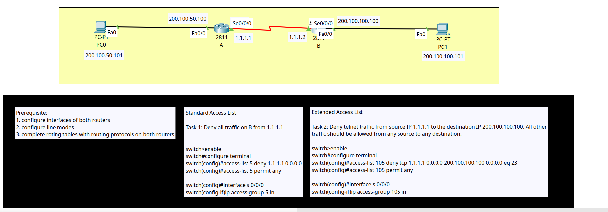

<div align="center">

# 🛡️ Traffic Filtering & Network Security: Standard & Extended ACLs

[-00599C?style=for-the-badge&logo=cisco&logoColor=white)](https://cisco.com)
[]()
[-orange?style=for-the-badge)]()
[](https://cisco.com)
[]()

<p align="center">
  <b>Implementing and validating Extended Access Control Lists (ACL 105) to selectively block insecure Telnet administrative access (TCP 23) while permitting routine IP routing and ICMP traffic across a point-to-point WAN boundary.</b>
</p>

</div>

---

## 📌 Executive Summary

Access Control Lists (ACLs) are the first line of defense in Cisco network infrastructure. This lab demonstrates the configuration, placement, and directionality of an **Extended Access Control List (ACL 105)** applied on edge router **`Router B`**.

The objective is to enforce least-privilege administrative access by selectively **denying unencrypted Telnet traffic (TCP Port 23)** originating from Router A's WAN interface (`1.1.1.1`) destined to Router B's management LAN interface (`200.100.100.100`), while maintaining unrestricted flow for all other IP services (OSPF dynamic routing, ICMP pings, and standard data packets).

---

## 🗺️ Network Topology & Architecture

<div align="center">
  
</div>

---

## 📊 IP Addressing Schema

| Device | Interface | IP Address | Subnet Mask | Default Gateway | Function / Role |
| :--- | :--- | :--- | :--- | :--- | :--- |
| **Router A** | `Fa0/0` | `200.100.50.100` | `255.255.255.0` | N/A | Branch A LAN Gateway |
| **Router A** | `Se0/0/0` | `1.1.1.1` | `255.0.0.0` | N/A | Point-to-Point WAN Link |
| **Router B** | `Se0/0/0` | `1.1.1.2` | `255.0.0.0` | N/A | Point-to-Point WAN Link (ACL Inbound) |
| **Router B** | `Fa0/0` | `200.100.100.100` | `255.255.255.0` | N/A | Branch B LAN Gateway |
| **PC0** | `NIC` | `200.100.50.101` | `255.255.255.0` | `200.100.50.100` | Branch A User Workstation |
| **PC1** | `NIC` | `200.100.100.101` | `255.255.255.0` | `200.100.100.100` | Branch B Server Host |

---

## 🎯 Key CCNA Security Concepts Demonstrated

### 1. Standard vs. Extended ACL Differences
* **Standard ACLs (1–99):** Filter based **only on Source IP address**. Must be placed as close to the destination as possible.
* **Extended ACLs (100–199):** Filter based on **Source IP, Destination IP, Protocol (TCP/UDP/ICMP), and Port Number**. Must be placed as close to the traffic source as possible.

### 2. The Implicit Deny Rule
Every Cisco ACL ends with an invisible **`deny ip any any`** statement. If a packet does not match any permit rule, it is dropped by default. In this lab, rule `access-list 105 permit ip any any` was explicitly added to prevent dropping OSPF routing updates and normal data traffic.

---

## 🛠️ Cisco IOS Configuration Highlights

### 🔹 Router A Configuration (Traffic Source & OSPF)
```ios
hostname A
!
interface FastEthernet0/0
 ip address 200.100.50.100 255.255.255.0
 no shutdown
!
interface Serial0/0/0
 ip address 1.1.1.1 255.0.0.0
 no shutdown
!
router ospf 7
 network 1.1.1.1 0.0.0.0 area 0
 network 200.100.50.0 0.0.0.255 area 0
!
line vty 0 4
 password corvit
 login
!
```

### 🔹 Router B Configuration (Extended ACL Filtering)
```ios
hostname B
!
interface FastEthernet0/0
 ip address 200.100.100.100 255.255.255.0
 no shutdown
!
interface Serial0/0/0
 ip address 1.1.1.2 255.0.0.0
 clock rate 2000000
 ip access-group 105 in
 no shutdown
!
router ospf 7
 network 1.1.1.2 0.0.0.0 area 0
 network 200.100.100.0 0.0.0.255 area 0
!
! --- Extended Access Control List ---
! Rule 1: Block Telnet (TCP 23) from WAN IP 1.1.1.1 to LAN IP 200.100.100.100
access-list 105 deny tcp host 1.1.1.1 host 200.100.100.100 eq telnet
! Rule 2: Explicitly permit all remaining IP traffic
access-list 105 permit ip any any
!
line vty 0 4
 password corvit
 login
!
```

---

## 🔍 Verification & Security Testing

### 1. ACL Hit Counters on `Router B`
```text
B# show access-lists
Extended IP access list 105
    10 deny tcp host 1.1.1.1 host 200.100.100.100 eq telnet
    20 permit ip any any (136 match(es))
```

### 2. Security Test Matrix

| Test Scenario | Traffic Type | Source | Destination | Expected Result | Actual Result |
| :--- | :--- | :--- | :--- | :--- | :--- |
| **Telnet Attempt** | TCP Port 23 | `Router A (1.1.1.1)` | `Router B (200.100.100.100)` | ❌ **Connection Refused / Denied** | ✅ **Blocked (Matched Rule 10)** |
| **ICMP Ping Test** | ICMP (Echo) | `Router A (1.1.1.1)` | `Router B (200.100.100.100)` | ✔️ **Successful (0% Loss)** | ✅ **Permitted (Matched Rule 20)** |
| **OSPF Adjacency** | IP Protocol 89 | `Router A (1.1.1.1)` | `224.0.0.5` | ✔️ **FULL / Adjacency UP** | ✅ **Permitted (Matched Rule 20)** |
| **End-to-End Host Ping**| ICMP | `PC0 (200.100.50.101)` | `PC1 (200.100.101.101)` | ✔️ **Successful (0% Loss)** | ✅ **Permitted (Matched Rule 20)** |

---

## 📦 Included Artifacts

* `access-control-lists.pkt` — Cisco Packet Tracer simulation file.
* `topology.png` — High-definition network topology diagram.
* `router-a-config.ios` — Full running configuration for Router A.
* `router-b-config.ios` — Full running configuration for Router B.