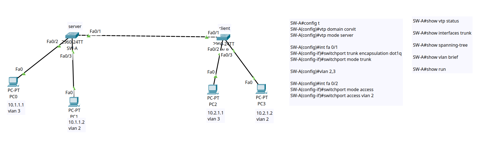

# 🏢 Layer 2 Infrastructure: VLAN Segmentation, 802.1Q Trunking & VTP

## 1. Network Topology


---

## 2. Port & VLAN Allocation Table

| Switch | Port | Port Mode | Assigned VLAN | VLAN Name | Connected Device | IP Address |
| :--- | :--- | :--- | :--- | :--- | :--- | :--- |
| **SW-A** | `Fa0/1` | **Trunk (802.1Q)** | Native 1 (VLANs 1,2,3) | `Trunk_Uplink` | `SW-B (Fa0/1)` | N/A |
| **SW-A** | `Fa0/2` | **Access** | **VLAN 3** | `Engineering` | PC0 (Eng-1) | `10.1.1.1/24` |
| **SW-A** | `Fa0/3` | **Access** | **VLAN 2** | `Sales_HR` | PC1 (Sales-1) | `10.1.1.2/24` |
| **SW-B** | `Fa0/1` | **Trunk (802.1Q)** | Native 1 (VLANs 1,2,3) | `Trunk_Uplink` | `SW-A (Fa0/1)` | N/A |
| **SW-B** | `Fa0/2` | **Access** | **VLAN 3** | `Engineering` | PC2 (Eng-2) | `10.2.1.1/24` |
| **SW-B** | `Fa0/3` | **Access** | **VLAN 2** | `Sales_HR` | PC3 (Sales-2) | `10.2.1.2/24` |

---

## 3. Key Layer 2 Concepts Demonstrated

### 1. Broadcast Domain Segmentation (VLANs)
VLANs logically segment a single physical switch into multiple isolated Layer 2 broadcast domains. Devices in **VLAN 2** cannot communicate with devices in **VLAN 3** at Layer 2 without an intermediate Layer 3 routing engine (Router-on-a-Stick or L3 switch).

### 2. IEEE 802.1Q Frame Tagging (Trunking)
The inter-switch link (`Fa0/1`) is configured as an **802.1Q trunk**. Frames traversing this link have a 4-byte 802.1Q tag inserted into the Ethernet header containing the **VLAN ID (VID)**, allowing both switches to maintain traffic separation across a single physical cable.

### 3. VLAN Trunking Protocol (VTP)
* **VTP Server (`SW-A`):** Manages the global VLAN database (`corvit`), creates VLANs 2 and 3, and increments the **Configuration Revision Number to 2**.
* **VTP Client (`SW-B`):** Receives VTP summary advertisements across the trunk and dynamically synchronizes its local VLAN database to match the server.

---

## 4. Cisco IOS Configuration Highlights

### 🔹 Switch A (`SW-A` - VTP Server)
```ios
hostname SW-A
!
vtp domain corvit
vtp mode server
!
vlan 2
 name Sales_HR
vlan 3
 name Engineering
!
interface FastEthernet0/1
 description Interswitch_Trunk_Link_to_SW-B
 switchport mode trunk
!
interface FastEthernet0/2
 description Access_VLAN3_Engineering
 switchport mode access
 switchport access vlan 3
!
interface FastEthernet0/3
 description Access_VLAN2_Sales_HR
 switchport mode access
 switchport access vlan 2
!
```

### 🔹 Switch B (`SW-B` - VTP Client)
```ios
hostname SW-B
!
vtp domain corvit
vtp mode client
!
interface FastEthernet0/1
 description Interswitch_Trunk_Link_to_SW-A
 switchport mode trunk
!
interface FastEthernet0/2
 description Access_VLAN3_Engineering
 switchport mode access
 switchport access vlan 3
!
interface FastEthernet0/3
 description Access_VLAN2_Sales_HR
 switchport mode access
 switchport access vlan 2
!
```

---

## 5. Verification & Operational Evidence

### 🔹 VTP Domain & Revision Synchronization (`show vtp status`)
```text
SW-A# show vtp status
VTP Domain Name                 : corvit
VTP Operating Mode              : Server
Number of existing VLANs        : 7
Configuration Revision          : 2

SW-B# show vtp status
VTP Domain Name                 : corvit
VTP Operating Mode              : Client
Number of existing VLANs        : 7
Configuration Revision          : 2
```
*Validation:* The revision number (`2`) and number of VLANs (`7`) match on both switches, proving successful VTP advertisement propagation.

---

### 🔹 802.1Q Trunk Port Verification (`show interfaces trunk`)
```text
SW-A# show interfaces trunk
Port        Mode         Encapsulation  Status        Native vlan
Fa0/1       on           802.1q         trunking      1

Port        Vlans allowed and active in management domain
Fa0/1       1,2,3
```

---

### 🔹 Traffic Isolation & Reachability Test Matrix

| Source Host | Source VLAN | Destination Host | Destination VLAN | Expected Result | Actual Result |
| :--- | :--- | :--- | :--- | :--- | :--- |
| `PC1 (Sales-1)` | **VLAN 2** | `PC3 (Sales-2)` | **VLAN 2** | ✔️ **Successful (0% Loss)** | ✅ **Passed (Across Trunk)** |
| `PC0 (Eng-1)` | **VLAN 3** | `PC2 (Eng-2)` | **VLAN 3** | ✔️ **Successful (0% Loss)** | ✅ **Passed (Across Trunk)** |
| `PC1 (Sales-1)` | **VLAN 2** | `PC0 (Eng-1)` | **VLAN 3** | ❌ **Blocked / Isolated** | ✅ **Isolated (Layer 2 Boundary)** |

---

## 6. Included Files
* `vlan-trunking.pkt` — Cisco Packet Tracer simulation file.
* `topology.png` — Network topology diagram.
* `sw-a-server-config.ios` — Cisco IOS configuration for Switch A.
* `sw-b-client-config.ios` — Cisco IOS configuration for Switch B.