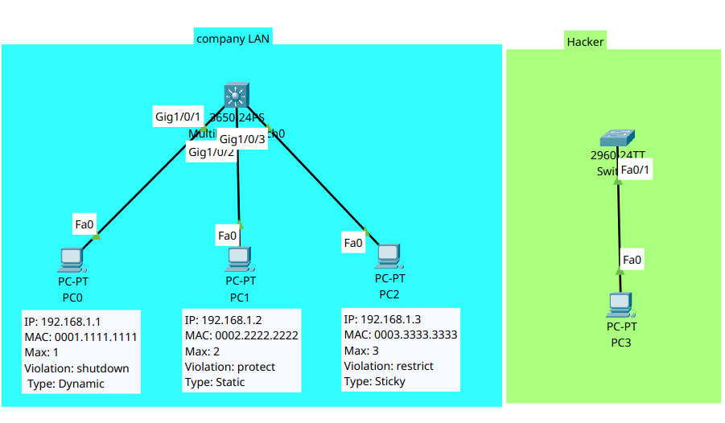

<div align="center">

# 🔒 Layer 2 Security: Port Security, MAC Limiting & Violation Modes

[](https://cisco.com)
[](https://cisco.com)
[]()
[]()
[]()

<p align="center">
  <b>Hardening Layer 2 switchports against unauthorized endpoint attachment and MAC flooding attacks by configuring dynamic, static, and sticky MAC address limits with Shutdown, Restrict, and Protect violation policies.</b>
</p>

</div>

---

## 📌 Executive Summary

Unsecured switchports permit any rogue device to plug into the corporate network, posing severe risks of **CAM Table Overflow (MAC flooding)** attacks and unauthorized network access.

This lab configures and compares the three primary **Port Security Violation Modes** and three **MAC Address Learning Methods** on a Cisco Catalyst 3650 switch:
* **Port `Gig1/0/1` (Shutdown / Dynamic):** Strict policy dropping rogue links into `err-disabled` state.
* **Port `Gig1/0/2` (Protect / Static):** Hardcoded MAC address dropping unauthorized frames silently.
* **Port `Gig1/0/3` (Restrict / Sticky):** Dynamically learns and commits MACs to the running config while generating Syslog alerts and incrementing violation counters upon unauthorized traffic.

---

## 🗺️ Network Topology & Architecture

<div align="center">
  
</div>

---

## 📊 Port Security Configuration Matrix

| Switch Port | Connected Device | Max MACs | Learning Method | Configured / Learned MAC | Violation Mode | Operational Behavior on Violation |
| :--- | :--- | :--- | :--- | :--- | :--- | :--- |
| **`Gig1/0/1`** | PC0 (Corporate) | **1** | **Dynamic** | Learned on first frame | **Shutdown** | Disables port into `err-disabled` state; generates log |
| **`Gig1/0/2`** | PC1 (Executive) | **2** | **Static** | `0002.2222.2222` | **Protect** | Drops unauthorized traffic silently; no logs generated |
| **`Gig1/0/3`** | PC2 (Engineering)| **3** | **Sticky** | `0003.3333.3333` (Saved) | **Restrict** | Drops traffic, generates Syslog alert, increments counter |
| **Rogue PC** | PC3 (Hacker) | N/A | Unauthorized | Spoofed / Foreign MAC | N/A | Triggers configured violation policy on any target port |

---

## 🎯 Deep Dive: Port Security Violation Modes

Understanding the differences between violation modes is a foundational CCNA and production NOC requirement:

| Feature / Behavior | `Protect` Mode | `Restrict` Mode | `Shutdown` Mode (Default) |
| :--- | :--- | :--- | :--- |
| **Drops Unauthorized Traffic?** | ✅ Yes | ✅ Yes | ✅ Yes |
| **Increments Violation Counter?** | ❌ No | ✅ Yes (`SecurityViolation` count +1) | ✅ Yes |
| **Sends Syslog / SNMP Trap?** | ❌ No | ✅ Yes | ✅ Yes |
| **Changes Interface State?** | ❌ Remains `Up/Up` | ❌ Remains `Up/Up` | ⚠️ Shuts down into **`err-disabled`** |
| **Recovery Requirement** | Automatic once rogue stops | Automatic once rogue stops | Manual `shut`/`no shut` or `errdisable recovery` |

---

## 🛠️ Cisco IOS Switchport Configurations

```ios
hostname Switch
!
! --- Port 1: Dynamic Learning with Default Shutdown Violation ---
interface GigabitEthernet1/0/1
 description Corporate_Host_PC0_Dynamic
 switchport mode access
 switchport port-security
!
! --- Port 2: Static MAC Assignment with Protect Mode ---
interface GigabitEthernet1/0/2
 description Executive_Host_PC1_Static
 switchport mode access
 switchport port-security
 switchport port-security maximum 2
 switchport port-security violation protect
 switchport port-security mac-address 0002.2222.2222
!
! --- Port 3: Sticky Learning with Restrict Mode ---
interface GigabitEthernet1/0/3
 description Engineering_Host_PC2_Sticky
 switchport mode access
 switchport port-security
 switchport port-security maximum 3
 switchport port-security mac-address sticky
 switchport port-security violation restrict
 switchport port-security mac-address sticky 0003.3333.3333
!
! --- Optional Enterprise Best Practice: Automatic Errdisable Recovery ---
errdisable recovery cause psecure-violation
errdisable recovery interval 30
!
```

---

## 🔍 Verification & Security State Evidence

### 1. Global Port Security Summary (`show port-security`)
```text
Switch# show port-security
Secure Port MaxSecureAddr CurrentAddr SecurityViolation Security Action
               (Count)       (Count)        (Count)
--------------------------------------------------------------------
     Gig1/0/1        1          0                 0         Shutdown
     Gig1/0/2        2          1                 0          Protect
     Gig1/0/3        3          1                 0         Restrict
--------------------------------------------------------------------
```

---

### 2. Secure MAC Address Table (`show port-security address`)
```text
Switch# show port-security address
               Secure Mac Address Table
-----------------------------------------------------------------------------
Vlan    Mac Address       Type                          Ports   Remaining Age
                                                                   (mins)
----    -----------       ----                          -----   -------------
   1    0002.2222.2222    SecureConfigured              Gig1/0/2     -
   1    0003.3333.3333    SecureSticky                  Gig1/0/3     -
-----------------------------------------------------------------------------
```

---

### 3. Detailed Interface Inspection (`show port-security interface Gig1/0/3`)
```text
Switch# show port-security interface gigabitEthernet1/0/3
Port Security              : Enabled
Port Status                : Secure-up
Violation Mode             : Restrict
Aging Time                 : 0 mins
Aging Type                 : Absolute
SecureStatic Address Aging : Disabled
Maximum MAC Addresses      : 3
Total MAC Addresses        : 1
Configured MAC Addresses   : 0
Sticky MAC Addresses       : 1
Last Source Address:Vlan   : 0000.0000.0000:0
Security Violation Count   : 0
```

---

## 🧰 Helping, Verification & Troubleshooting Command Reference

| Command | Execution Level | Diagnostic Output & Operational Purpose |
| :--- | :--- | :--- |
| `show port-security` | Privileged EXEC (`#`) | Displays summary of all secure ports, max allowed addresses, current learned count, violation counters, and active violation mode. |
| `show port-security address` | Privileged EXEC (`#`) | Lists all secure MAC addresses stored in the switch database and their learning type (`SecureConfigured`, `SecureDynamic`, `SecureSticky`). |
| `show port-security interface <id>` | Privileged EXEC (`#`) | Comprehensive status of a specific interface, including current status (`Secure-up` / `Secure-down`), violation counts, and last offending MAC. |
| `show mac address-table` | Privileged EXEC (`#`) | Displays active CAM table entries; secure MACs are listed with type `STATIC`. |
| `show errdisable recovery` | Privileged EXEC (`#`) | Displays configured automated recovery timers for `psecure-violation` and remaining recovery time. |
| `clear port-security sticky` | Privileged EXEC (`#`) | Clears dynamically learned sticky MAC addresses from the running configuration without rebooting. |

---

## ⚡ Rogue Device Attack & Violation Test Matrix

| Target Port | Connected Attacker | Injected Source MAC | Configured Action | Switch Reaction | Verification Status |
| :--- | :--- | :--- | :--- | :--- | :--- |
| **`Gig1/0/1`** | Rogue PC3 | `0004.4444.4444` | **Shutdown** | Port drops into `err-disabled` state; link light turns amber | ✅ **Blocked (`err-disabled`)** |
| **`Gig1/0/2`** | Rogue PC3 | `0004.4444.4444` | **Protect** | Frames dropped silently; authorized MAC `0002.2222.2222` maintains normal communication | ✅ **Filtered (Silent Drop)** |
| **`Gig1/0/3`** | Rogue PC3 | `0004.4444.4444` | **Restrict** | Frames dropped; Syslog alert generated; `SecurityViolation` counter increments | ✅ **Logged & Filtered** |

---

## 📦 Included Artifacts

* `port-security.pkt` — Complete Cisco Packet Tracer simulation file.
* `topology.png` — Network topology diagram.
* `switch-port-security-config.ios` — Cisco Catalyst 3650 switchport security running configuration.
