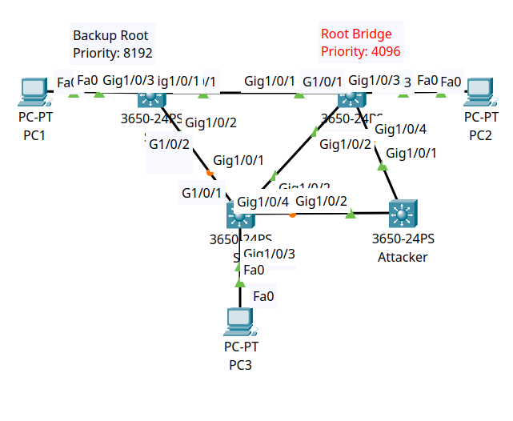

<div align="center">

# 🛡️ Layer 2 Hardening: Spanning Tree Protocol (STP) Root Guard

[](https://cisco.com)
[](https://cisco.com)
[-brightgreen?style=for-the-badge)]()
[-orange?style=for-the-badge)]()
[]()

<p align="center">
  <b>Protecting enterprise Spanning Tree topology stability by deploying Cisco STP Root Guard on designated downstream switchports to prevent rogue switches from hijacking the Root Bridge role.</b>
</p>

</div>

---

## 📌 Executive Summary

In a standard Spanning Tree topology, any switch that introduces a **superior BPDU (lower Bridge ID / Priority)** can dynamically force a network-wide recalculation and become the new **Root Bridge**. An attacker can exploit this by attaching a rogue switch configured with **Priority 0**, forcing all enterprise inter-VLAN and user traffic to transit through the rogue device (Man-in-the-Middle / Traffic Interception).

This lab demonstrates how to configure **STP Root Guard (`spanning-tree guard root`)** on legitimate Core/Distribution switches (**`S2`** and **`S1`**) and Access switches (**`S3`**). When the rogue **`Attacker` switch (Priority 0)** introduces superior BPDUs, Root Guard immediately transitions the receiving interface into **`ROOT_Inc` (Root-Inconsistent / Blocking)** state, neutralizing the attack while keeping `S2` as the legitimate Root Bridge.

---

## 🗺️ Network Topology & Architecture

<div align="center">
  
</div>

---

## 📊 Bridge ID & STP Parameter Schema

| Switch | Role in Network | Bridge Priority | Base MAC Address | Effective Bridge ID | Root Guard Enabled Ports |
| :--- | :--- | :--- | :--- | :--- | :--- |
| **`S2`** | **Primary Root Bridge** | **`4096`** | `0001.42AC.06BB` | `4097.0001.42AC.06BB` | `Gig1/0/1 - 24` (All Downlinks) |
| **`S1`** | **Backup Root Bridge** | **`8192`** | `0000.0C5A.0362` | `8193.0000.0C5A.0362` | `Gig1/0/3 - 24` (Edge Ports) |
| **`S3`** | **Access Layer Switch** | `32768` (Default) | `0060.5C4C.16AC` | `32769.0060.5C4C.16AC` | `Gig1/0/3 - 24` (Edge Ports) |
| **`Attacker`** | **Rogue Switch** | **`0` (Superior)** | `0001.4278.C590` | `1.0001.4278.C590` | N/A (Attack Generator) |

---

## 🎯 Attack Mechanics vs. Root Guard Defense

### 1. The Vulnerability (Rogue Root Bridge Hijack)
Without Root Guard, an attacker plugs into access ports on `S2` and `S3`, advertising BPDUs with `Priority 0`. Because `Priority 0 < Priority 4096`, all switches immediately demote `S2` and elect the attacker as the Root Bridge, altering traffic forwarding paths.

### 2. The Defense Mechanism (`spanning-tree guard root`)
Root Guard is enabled on **Designated Ports** where a Root Bridge should **never** be discovered. 
* When a superior BPDU arrives on a Root Guard-enabled port, the switch **does not accept the new Root ID**.
* The port is placed into **`Root-Inconsistent (ROOT_Inc)`** state (listening/blocking), preventing data forwarding.
* **Auto-Recovery:** Once the rogue device stops transmitting superior BPDUs, the port automatically recovers back to forwarding state without manual administrator intervention.

---

## 🛠️ Cisco IOS Configuration Highlights

### 🔹 Switch `S2` (Primary Root Bridge — Priority 4096)
```ios
hostname S2
!
spanning-tree mode pvst
spanning-tree vlan 1 priority 4096
!
interface range GigabitEthernet1/0/1 - 24
 description Downlink_Ports_RootGuard_Protected
 spanning-tree guard root
!
```

### 🔹 Switch `S1` (Backup Root Bridge — Priority 8192)
```ios
hostname S1
!
spanning-tree mode pvst
spanning-tree vlan 1 priority 8192
!
interface range GigabitEthernet1/0/3 - 24
 description Access_Ports_RootGuard_Protected
 spanning-tree guard root
!
```

### 🔹 Switch `S3` (Access Switch)
```ios
hostname S3
!
spanning-tree mode pvst
!
interface range GigabitEthernet1/0/3 - 24
 description Host_Ports_RootGuard_Protected
 spanning-tree guard root
!
```

### 🔹 Rogue Switch `Attacker` (Simulated Attack)
```ios
hostname Attacker
!
spanning-tree mode pvst
spanning-tree vlan 1 priority 0
!
```

---

## 🔍 Verification & Operational Proof

### 1. Verification of Legitimate Root on `S2`
```text
S2# show spanning-tree
VLAN0001
  Spanning tree enabled protocol ieee
  Root ID    Priority    4097
             Address     0001.42AC.06BB
             This bridge is the root
```

---

### 2. Verification of Root Path on `S1` and `S3`
```text
S1# show spanning-tree
  Root ID    Priority    4097
             Address     0001.42AC.06BB
             Cost        4
             Port        1 (GigabitEthernet1/0/1)

S3# show spanning-tree
  Root ID    Priority    4097
             Address     0001.42AC.06BB
             Cost        4
             Port        2 (GigabitEthernet1/0/2)
```
*Validation:* Despite the Attacker switch running Priority 0, both `S1` and `S3` continue pointing to `S2` (`0001.42AC.06BB`) as the true Root Bridge.

---

## 🧰 Helping, Verification & Troubleshooting Command Reference

| Command | Execution Mode | Diagnostic Purpose & Operational Value |
| :--- | :--- | :--- |
| `show spanning-tree` | Privileged EXEC (`#`) | Displays the active Root Bridge ID, local Bridge ID, timers, and the role/status of all physical switchports. |
| `show spanning-tree vlan <id>` | Privileged EXEC (`#`) | Displays STP topology details restricted to a specific VLAN. |
| `show spanning-tree detail` | Privileged EXEC (`#`) | Provides exhaustive port information including whether Root Guard is enabled and if the port is in `root-inconsistent` state. |
| `show spanning-tree inconsistentports` | Privileged EXEC (`#`) | *(Production IOS)* Lists all switchports currently placed in inconsistent state by Root Guard. |
| `show run | include spanning-tree` | Privileged EXEC (`#`) | Quickly filters the running configuration for all global and interface-level STP parameters. |
| `debug spanning-tree events` | Privileged EXEC (`#`) | Real-time logging of BPDU generation, topology changes, and Root Guard state triggers. |

---

## ⚡ Attack Simulation & Mitigation Test Matrix

| Attack Phase | Action Performed | Topology Impact | Network Status |
| :--- | :--- | :--- | :--- |
| **Baseline State** | `S2` configured with Priority 4096; `S1` with Priority 8192 | `S2` elected as global Root Bridge; legitimate path convergence | ✅ **Normal Operations** |
| **Rogue Attack (No Guard)**| Attacker injected with Priority 0 without Root Guard | All switches recalculate; Attacker becomes Root Bridge; traffic hijacked | ❌ **Compromised (Man-in-the-Middle)** |
| **Mitigation Active** | `spanning-tree guard root` enabled on `S2`, `S1`, `S3` downlinks | Ports connecting to Attacker block (`ROOT_Inc`); `S2` remains Root | ✅ **Protected (Zero Topology Shift)** |

---

## 📦 Included Artifacts

* `stp-root-guard.pkt` — Complete Cisco Packet Tracer simulation lab file.
* `topology.png` — Network topology diagram.
* `s2-root-bridge-config.ios` — Cisco IOS configuration for Primary Root Bridge S2.
* `s1-backup-root-config.ios` — Cisco IOS configuration for Backup Root Bridge S1.
* `s3-access-switch-config.ios` — Cisco IOS configuration for Access Switch S3.
* `attacker-rogue-switch-config.ios` — Configuration for the simulated rogue Attacker switch.
