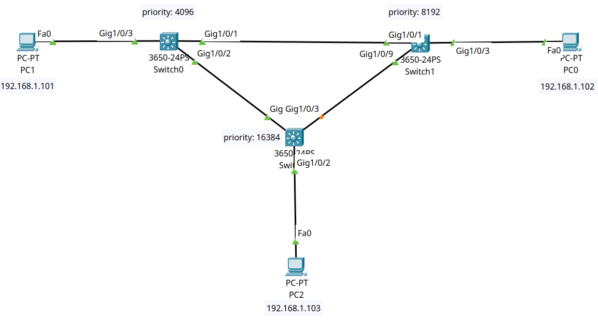

<div align="center">

# 🔄 Layer 2 Loop Prevention: STP Loop Guard & BPDU Filtering

[](https://cisco.com)
[](https://cisco.com)
[-brightgreen?style=for-the-badge)]()
[-orange?style=for-the-badge)]()
[]()

<p align="center">
  <b>Preventing catastrophic Layer 2 bridging loops caused by unidirectional link failures or erroneous BPDU filtering by deploying Cisco STP Loop Guard across redundant switch interlinks.</b>
</p>

</div>

---

## 📌 Executive Summary

In redundant Layer 2 networks, Spanning Tree relies on the continuous reception of **Bridge Protocol Data Units (BPDUs)** to maintain blocked/alternate ports. If an inter-switch link experiences a **unidirectional hardware failure** or if **BPDU filtering** is mistakenly enabled on an active trunk, the non-designated switch stops receiving BPDUs. 

Without protection, the switch assumes the link is dead, transitions its blocked port into **Designated Forwarding**, and creates a catastrophic **Layer 2 Bridging Loop (Broadcast Storm)**.

This lab demonstrates:
1. **The Vulnerability:** How enabling `bpdufilter` on trunk link `Gig1/0/9` creates an immediate switching loop.
2. **The Defense:** How enabling **STP Loop Guard (`spanning-tree loopguard default`)** detects the cessation of BPDUs and transitions the port into **`loop-inconsistent` (blocking)** state, neutralizing the loop.

---

## 🗺️ Network Topology & Architecture

<div align="center">
  
</div>

---

## 📊 Bridge ID & STP Parameter Schema

| Switch | Network Role | Configured Priority | Base MAC Address | Effective Bridge ID | Connected Trunk Interlinks |
| :--- | :--- | :--- | :--- | :--- | :--- |
| **`Switch0`** | **Primary Root Bridge** | **`4096`** | `00D0.BC25.A9A3` | `4097.00D0.BC25.A9A3` | `Gig1/0/1` (to SW1), `Gig1/0/2` (to SW2) |
| **`Switch1`** | **Secondary Root Bridge** | **`8192`** | `000A.418C.65E7` | `8193.000A.418C.65E7` | `Gig1/0/1` (to SW0), `Gig1/0/9` (to SW2) |
| **`Switch2`** | **Access Layer Switch** | **`16384`** | `0001.C791.DB85` | `16385.0001.C791.DB85`| `Gig1/0/1` (to SW0), `Gig1/0/3` (to SW1) |

---

## 🎯 Deep Dive: BPDU Guard vs. BPDU Filter vs. Loop Guard

A critical distinction frequently evaluated in CCNA and NOC engineering interviews:

| STP Feature | Primary Objective | Placement Recommendation | Reaction on Trigger |
| :--- | :--- | :--- | :--- |
| **BPDU Guard** | Prevents rogue switches on edge ports | **Access / Host Ports only** (`portfast`) | Disables port immediately into **`err-disabled`** |
| **BPDU Filter** | Suppresses BPDU transmission/reception | **Specialized Lab / Edge cases** | Ignores BPDUs; can cause loops if used on trunks |
| **Loop Guard** | Prevents loops from missing BPDUs | **Root & Alternate Ports** (Trunk links) | Transitions port into **`loop-inconsistent` (blocking)** |

---

## 🛠️ Cisco IOS Configuration Highlights

### 🔹 Switch 0 (Primary Root Bridge)
```ios
hostname Switch0
!
spanning-tree mode pvst
spanning-tree vlan 1 priority 4096
spanning-tree loopguard default
!
interface GigabitEthernet1/0/1
 description Trunk_to_Switch1
!
interface GigabitEthernet1/0/2
 description Trunk_to_Switch2
!
interface GigabitEthernet1/0/3
 description Access_to_PC1
!
```

### 🔹 Switch 1 (Secondary Root Bridge & BPDU Filter Simulation)
```ios
hostname Switch1
!
spanning-tree mode pvst
spanning-tree vlan 1 priority 8192
spanning-tree loopguard default
!
interface GigabitEthernet1/0/1
 description Trunk_to_Switch0_RootPort
!
interface GigabitEthernet1/0/9
 description Trunk_to_Switch2_LoopGuard_Protected
!
interface GigabitEthernet1/0/3
 description Access_to_PC0
!
```

### 🔹 Switch 2 (Access Layer Switch)
```ios
hostname Switch2
!
spanning-tree mode pvst
spanning-tree vlan 1 priority 16384
spanning-tree loopguard default
!
interface GigabitEthernet1/0/1
 description Trunk_to_Switch0_RootPort
!
interface GigabitEthernet1/0/3
 description Trunk_to_Switch1_AlternatePort
!
interface GigabitEthernet1/0/2
 description Access_to_PC2
!
```

---

## 🔍 Verification & Operational Proof

### 1. Root Bridge Election on `Switch0`
```text
Switch0# show spanning-tree
VLAN0001
  Spanning tree enabled protocol ieee
  Root ID    Priority    4097
             Address     00D0.BC25.A9A3
             This bridge is the root
```

---

### 2. Alternate Port Blocking on `Switch2`
```text
Switch2# show spanning-tree
Interface        Role Sts Cost      Prio.Nbr Type
---------------- ---- --- --------- -------- --------------------------------
Gi1/0/1          Root FWD 4         128.1    P2p
Gi1/0/2          Desg FWD 19        128.2    P2p
Gi1/0/3          Altn BLK 4         128.3    P2p
```
*Validation:* `Gi1/0/3` is correctly placed in Alternate Blocking (`Altn BLK`) state to eliminate the Layer 2 loop.

---

## 🧰 Helping, Verification & Troubleshooting Command Reference

| Command | Execution Mode | Diagnostic Purpose & Operational Value |
| :--- | :--- | :--- |
| `show spanning-tree` | Privileged EXEC (`#`) | Displays current STP topology, active Root Bridge ID, port costs, and port states (`FWD`, `BLK`, `LSN`). |
| `show spanning-tree detail` | Privileged EXEC (`#`) | Exhaustive diagnostic output verifying whether Loop Guard is enabled and tracking `loop-inconsistent` states. |
| `show spanning-tree summary` | Privileged EXEC (`#`) | High-level overview displaying global STP features (PortFast, BPDU Guard, BPDU Filter, Loop Guard default states). |
| `debug spanning-tree events` | Privileged EXEC (`#`) | Real-time debugging of BPDU transitions and Loop Guard state triggers. |

---

## ⚡ Failure Simulation & Loop Guard Mitigation Matrix

| Test Scenario | Action Performed | STP Reaction Without Loop Guard | STP Reaction With Loop Guard | Status |
| :--- | :--- | :--- | :--- | :--- |
| **Normal Operations** | Converged 3-switch topology | `Switch2 (Gi1/0/3)` blocks in `Altn BLK` | `Switch2 (Gi1/0/3)` blocks in `Altn BLK` | ✅ **Loop-Free** |
| **Unidirectional Loss**| Enable `bpdufilter` on `SW1 Gi1/0/9` | Port moves to `FWD` → **Broadcast Storm** | Port moves to **`loop-inconsistent` (BLK)** | ✅ **Protected** |
| **Link Recovery** | Remove `bpdufilter` (`no spanning-tree bpdufilter`) | Manual reboot required to resolve storm | Port automatically recovers to `Altn BLK` | ✅ **Auto-Healed** |

---

## 📦 Included Artifacts

* `bpdu-filtering-loop-guard.pkt` — Complete Cisco Packet Tracer simulation file.
* `topology.png` — Network topology diagram.
* `switch0-root-config.ios` — Running configuration for Primary Root Bridge Switch0.
* `switch1-backup-config.ios` — Running configuration for Secondary Root Bridge Switch1.
* `switch2-access-config.ios` — Running configuration for Access Switch Switch2.
