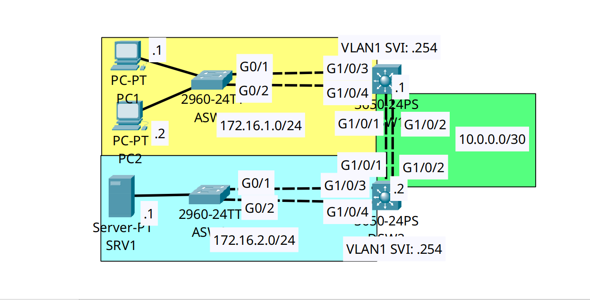

<div align="center">

# 🔄 Campus Link Aggregation: LACP, PAgP & L3 Routed EtherChannel

[](https://cisco.com)
[](https://cisco.com)
[]()
[]()

<p align="center">
  <b>Eliminating STP blocked ports and multiplying campus backbone bandwidth by deploying Layer 2 negotiated EtherChannels (LACP/PAgP) alongside high-speed Layer 3 routed bundles.</b>
</p>

</div>

---

## 📌 Executive Summary & Engineering Objective

In traditional Layer 2 topologies, Spanning Tree Protocol (STP) prevents bridging loops by actively blocking redundant parallel links. This results in wasted physical bandwidth. **EtherChannel (Link Aggregation)** solves this by logically bundling multiple physical links into a single logical `Port-Channel` interface. STP views the bundle as a single link, allowing traffic to actively load-balance across all physical cables simultaneously.

This lab proves advanced Link Aggregation competence by implementing three distinct EtherChannel architectures:
1. **IEEE 802.3ad LACP (Link Aggregation Control Protocol):** Configured a dynamic Layer 2 standard-based trunk between `DSW1` and `ASW1` using the `active` state.
2. **Cisco PAgP (Port Aggregation Protocol):** Configured a dynamic Layer 2 proprietary trunk between `DSW2` and `ASW2` using the `desirable` state.
3. **Layer 3 Static EtherChannel:** Configured a routed, non-switching bundle (`no switchport`) between the two Distribution Switches (`DSW1` and `DSW2`) statically forced `on`, facilitating high-speed transit routing.

---

## 🗺️ Network Topology & Architecture

<div align="center">
  
</div>

---

## 📊 EtherChannel Port-Channel Matrix

| Local Switch | Remote Switch | Interface Group | Logical Port | Bundle Type | Negotiation Protocol | Mode |
| :--- | :--- | :--- | :--- | :--- | :--- | :--- |
| **DSW1** | **ASW1** | `Gig1/0/3 - 1/0/4` | `Po1` | Layer 2 Trunk | **LACP** (802.3ad) | `active` / `active` |
| **DSW2** | **ASW2** | `Gig1/0/3 - 1/0/4` | `Po1` | Layer 2 Trunk | **PAgP** (Cisco) | `desirable` / `desirable` |
| **DSW1** | **DSW2** | `Gig1/0/1 - 1/0/2` | `Po2` | **Layer 3 Routed** | **Static** (None) | `on` / `on` |

---

## 🛠️ Cisco IOS Configuration Highlights

### 🔹 Scenario 1: IEEE 802.3ad LACP Layer 2 Trunk (DSW1 to ASW1)
```ios
DSW1(config)# interface range GigabitEthernet1/0/3-4
! 1. Define the protocol
DSW1(config-if-range)# channel-protocol lacp
! 2. Actively negotiate the bundle
DSW1(config-if-range)# channel-group 1 mode active
! 3. Configure the logical interface parameters
DSW1(config-if-range)# interface Port-channel1
DSW1(config-if)# switchport mode trunk
```

### 🔹 Scenario 2: Cisco PAgP Layer 2 Trunk (DSW2 to ASW2)
```ios
DSW2(config)# interface range GigabitEthernet1/0/3-4
DSW2(config-if-range)# channel-protocol pagp
DSW2(config-if-range)# channel-group 1 mode desirable
DSW2(config-if-range)# interface Port-channel1
DSW2(config-if)# switchport mode trunk
```

### 🔹 Scenario 3: Static Layer 3 Routed Bundle (DSW1 to DSW2)
```ios
DSW1(config)# interface range GigabitEthernet1/0/1-2
! 1. Convert physical interfaces to routed ports BEFORE bundling
DSW1(config-if-range)# no switchport
DSW1(config-if-range)# channel-group 2 mode on

! 2. Assign IP address directly to the logical Port-Channel
DSW1(config)# interface Port-channel2
DSW1(config-if)# no switchport
DSW1(config-if)# ip address 10.0.0.1 255.255.255.252
```

---

## 🔍 Verification & Operational Proof

The `show etherchannel summary` command is the definitive NOC diagnostic tool for verifying bundle health and Layer 2 vs. Layer 3 operational states.

### DSW1 Aggregation Status
```text
DSW1# show etherchannel summary
Flags:  D - down        P - in port-channel
        I - stand-alone s - suspended
        R - Layer3      S - Layer2
        U - in use      f - failed to allocate aggregator

Number of channel-groups in use: 2
Number of aggregators:           2

Group  Port-channel  Protocol    Ports
------+-------------+-----------+----------------------------------------------
1      Po1(SU)           LACP   Gig1/0/3(P) Gig1/0/4(P) 
2      Po2(RU)           -      Gig1/0/1(P) Gig1/0/2(P) 
```
*Validation:* 
* `Po1` shows `(SU)`: It is operating as a **Layer 2 Switched (`S`)** bundle currently **In Use (`U`)**. The protocol is dynamically negotiated via `LACP`.
* `Po2` shows `(RU)`: It is operating as a **Layer 3 Routed (`R`)** bundle currently **In Use (`U`)**. The protocol is `-` because it was forced `on` statically.
* The physical ports all show `(P)`, proving they are successfully bundled and passing traffic (not suspended or stand-alone).

---

## 🧰 NOC Diagnostic & Troubleshooting Cheat Sheet

| Diagnostic Command | Execution Mode | Incident Response Application |
| :--- | :--- | :--- |
| `show etherchannel summary` | Privileged EXEC (`#`) | Instantly validates bundle state flags (`SU` vs `RU`) and checks if physical ports have dropped out of the bundle (`I` or `s`). |
| `show etherchannel load-balance` | Privileged EXEC (`#`) | Displays the hashing algorithm (e.g., `src-dst-ip` or `src-mac`) the switch uses to distribute frames across the physical cables. |
| `show interfaces trunk` | Privileged EXEC (`#`) | Confirms that the logical `Port-channel` interface (not the physical ports) is successfully trunking 802.1Q tags. |

---

## 📦 Included Artifacts

* `etherchannel-lacp-pagp-layer3.pkt` — Packet Tracer enterprise aggregation simulation.
* `topology.png` — Network topology diagram.
* `dsw1-config.ios` & `dsw2-config.ios` — Distribution multilayer switch configs with L3 routing and L2/L3 bundles.
* `asw1-config.ios` & `asw2-config.ios` — Access switch configs demonstrating LACP vs PAgP edge connectivity.

