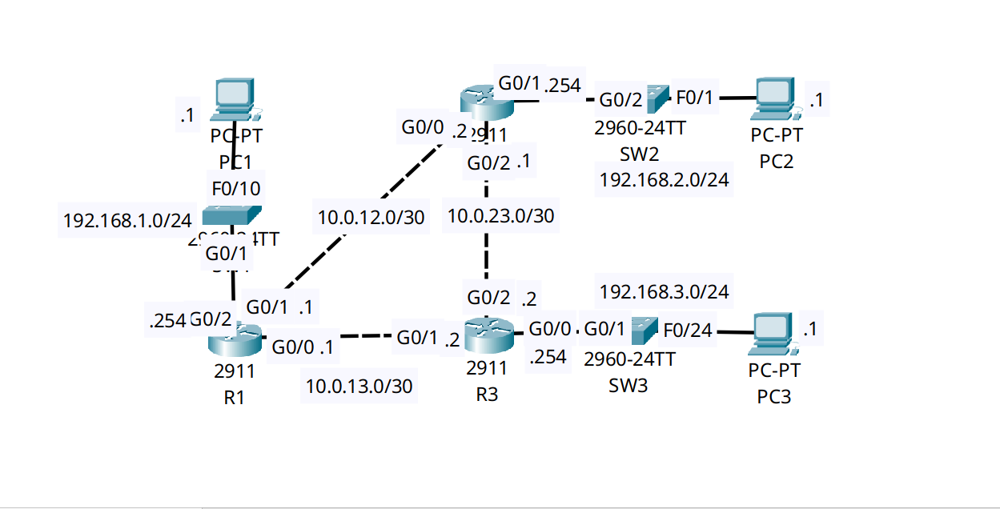

<div align="center">

# 🔄 Layer 2 Discovery & Security: LLDP Migration & Access-Port Hardening

[](https://cisco.com)
[](https://cisco.com)
[]()
[]()

<p align="center">
  <b>Balancing NOC visibility and network security by migrating from proprietary CDP to vendor-neutral LLDP, while strictly disabling discovery protocols on untrusted host-facing access ports.</b>
</p>

</div>

---

## 📌 Executive Summary & Engineering Objective

Layer 2 discovery protocols are the primary diagnostic tools utilized by NOC engineers to map physical network topologies, verify cabling, and detect duplex or native VLAN mismatches. However, if these protocols are left active on edge access ports, they broadcast sensitive hardware details (IOS versions, device models, IP management addresses) directly to end-users, creating a severe reconnaissance vulnerability.

This lab demonstrates a modern enterprise hardening baseline:
1. **Protocol Migration:** Disabling Cisco proprietary **CDP (Cisco Discovery Protocol)** globally in favor of the vendor-neutral IEEE standard **LLDP (Link Layer Discovery Protocol)** to support multi-vendor environments.
2. **Access-Port Hardening:** Granularly disabling LLDP transmission and reception (`no lldp transmit`, `no lldp receive`) on all host-facing edge ports (PCs/Servers) to prevent information leakage, while maintaining visibility strictly on infrastructure trunk uplinks.

---

## 🗺️ Network Topology & Architecture

<div align="center">
  
</div>

---

## 📊 Infrastructure Visibility Schema (LLDP Mapping)

Based on the verified LLDP adjacencies, the internal infrastructure maps out as follows:

| Local Device | Local Interface | Remote Device | Remote Interface | Capability Role |
| :--- | :--- | :--- | :--- | :--- |
| **R1 (Core)** | `Gig0/0` | **R3** | `Gig0/1` | Router (R) |
| **R1 (Core)** | `Gig0/1` | **R2** | `Gig0/0` | Router (R) |
| **R1 (Core)** | `Gig0/2` | **SW1** | `Gig0/1` | Bridge (B) |
| **SW2 (Edge)**| `Gig0/2` | **R2** | `Gig0/1` | Router (R) |

---

## 🛠️ Cisco IOS Configuration Highlights

### 🔹 R1: Global Protocol Migration (CDP to LLDP)
```ios
! 1. Disable the proprietary Cisco Discovery Protocol globally
R1(config)# no cdp run

! 2. Enable the IEEE standard Link Layer Discovery Protocol globally
R1(config)# lldp run
```

### 🔹 SW2: Edge Port Security Hardening
```ios
SW2(config)# lldp run
SW2(config)# no cdp run

! 3. Disable discovery protocol leakage on untrusted host-facing ports
SW2(config)# interface range FastEthernet0/1-24
SW2(config-if-range)# description ## Untrusted Edge Ports - Hardened ##
SW2(config-if-range)# no cdp enable
SW2(config-if-range)# no lldp transmit
SW2(config-if-range)# no lldp receive
```

---

## 🔍 Verification & Operational Proof

### 1. Verifying CDP is Successfully Eradicated (R1)
```text
R1# show cdp neighbors
% CDP is not enabled
```
*Validation:* CDP has been successfully disabled globally, ensuring no proprietary frames are transmitted across the infrastructure.

### 2. Validating LLDP Adjacencies on Core Infrastructure (R1)
```text
R1# show lldp neighbors
Capability codes:
    (R) Router, (B) Bridge, (T) Telephone, (C) DOCSIS Cable Device
    (W) WLAN Access Point, (P) Repeater, (S) Station, (O) Other
Device ID           Local Intf     Hold-time  Capability      Port ID
R3                  Gig0/0         120        R               Gig0/1
SW1                 Gig0/2         120        B               Gig0/1
R2                  Gig0/1         120        R               Gig0/0

Total entries displayed: 3
```
*Validation:* The core router maintains full visibility of its adjacent infrastructure devices using open-standard LLDP.

### 3. Validating LLDP Isolation on Edge Switch (SW2)
```text
SW2# show lldp neighbors
Capability codes:
    (R) Router, (B) Bridge, (T) Telephone, (C) DOCSIS Cable Device
    (W) WLAN Access Point, (P) Repeater, (S) Station, (O) Other
Device ID           Local Intf     Hold-time  Capability      Port ID
R2                  Gig0/2         120        R               Gig0/1

Total entries displayed: 1
```
*Validation:* SW2 successfully forms an LLDP adjacency with its upstream router (`R2`) on the designated uplink (`Gig0/2`). Because LLDP `transmit/receive` was disabled on all FastEthernet ports, no endpoints (PCs) can snoop or spoof LLDP frames.

---

## 🧰 NOC Diagnostic & Troubleshooting Cheat Sheet

| Diagnostic Command | Execution Mode | Incident Response Application |
| :--- | :--- | :--- |
| `show lldp neighbors` | Privileged EXEC (`#`) | Displays adjacent devices, local interface, and remote port ID. Used daily to trace blind physical cabling. |
| `show lldp neighbors detail` | Privileged EXEC (`#`) | Extracts comprehensive hardware details from the neighbor, including exact IOS version, Management IP address, and chassis capabilities. |
| `show lldp traffic` | Privileged EXEC (`#`) | Counters for LLDP frame transmission/reception. Useful for identifying if an interface is silently dropping discovery packets. |

---

## ⚡ Key Takeaway
**Visibility is a double-edged sword.** While protocols like LLDP are indispensable for NOC operations and physical link troubleshooting, transmitting them out of host-facing access ports grants malicious actors a complete blueprint of your network's management IP schema and hardware vulnerabilities. Always restrict discovery protocols to infrastructure interlinks.

---

## 📦 Included Artifacts

* `cdp-lldp-discovery-and-hardening.pkt` — Packet Tracer discovery simulation.
* `topology.png` — Network topology diagram.
* `r1-config.ios` — Core router configuration demonstrating global LLDP enablement.
* `sw2-config.ios` — Edge switch configuration detailing granular access-port hardening.`
