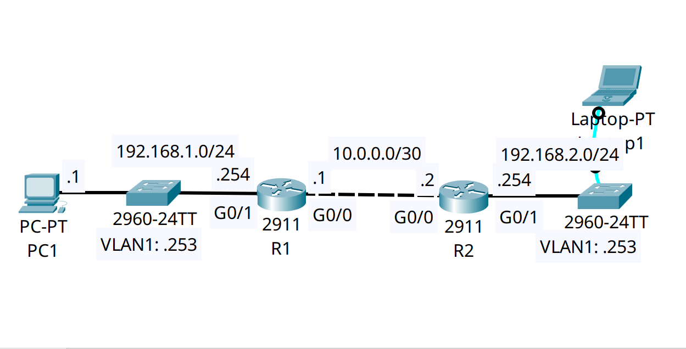

<div align="center">

# 🔄 Secure Control Plane Management: SSHv2 & VTY Access-Class Filtering

[](https://cisco.com)
[](https://cisco.com)
[]()
[]()

<p align="center">
  <b>Protecting enterprise network infrastructure by eradicating plaintext Telnet, enforcing cryptographically secure SSH management, and restricting administrative access to authorized NOC IP addresses.</b>
</p>

</div>

---

## 📌 Executive Summary & Engineering Objective

In a production enterprise network, the control and management planes must be strictly isolated and hardened. Legacy protocols like Telnet transmit credentials in plaintext, making the infrastructure highly vulnerable to packet sniffing and Man-in-the-Middle (MitM) attacks. Furthermore, management interfaces should never be accessible from general user subnets or the public Internet.

This lab implements a zero-trust baseline for device management:
1. **Cryptographic Hardening:** Generating a 2048-bit RSA key pair and enforcing SSH for encrypted terminal access.
2. **Local AAA Authentication:** Requiring a local username and a cryptographically hashed secret (Type 5) rather than a shared line password.
3. **Control Plane Filtering (`access-class`):** Binding a Standard IPv4 Access Control List (ACL) directly to the virtual terminal (VTY) lines, ensuring only the designated administrative workstation (`PC1: 192.168.1.1`) can initiate management sessions.

---

## 🗺️ Network Topology & Architecture

<div align="center">
  
</div>

---

## 📊 Security & Cryptographic Schema

| Parameter | Configuration Value | Security Purpose |
| :--- | :--- | :--- |
| **Domain Name** | `jeremysitlab.com` | Prerequisite for generating fully qualified RSA keys. |
| **RSA Key Size** | `2048 bits` | Enterprise minimum standard to prevent brute-force factoring. |
| **Authentication** | `login local` | Ties authentication to individual user accounts (`username jeremy`). |
| **VTY Restriction** | `access-class 1 in` | Drops all connection attempts not explicitly permitted by ACL 1. |
| **Permitted Admin** | `host 192.168.1.1` | The only IP address allowed to connect to the switch CLI. |
| **Timeout limit** | `exec-timeout 5 0` | Automatically drops idle sessions after 5 minutes to prevent hijacking. |

---

## 🛠️ Cisco IOS Configuration Highlights

### 🔹 Step 1: Cryptography & Local Authentication
```ios
! Define the domain name (Required for RSA key generation)
SW2(config)# ip domain-name jeremysitlab.com

! Create a local administrative account with a hashed secret
SW2(config)# username jeremy secret ccna

! Generate the RSA cryptographic keys (Not displayed in show run)
SW2(config)# crypto key generate rsa modulus 2048
```

### 🔹 Step 2: Defining the Management ACL
```ios
! Standard ACL 1 explicitly permitting only the authorized Network Admin workstation
SW2(config)# access-list 1 permit host 192.168.1.1
```

### 🔹 Step 3: Hardening the Virtual Terminal (VTY) Lines
```ios
SW2(config)# line vty 0 15
! 1. Restrict inbound connections using the ACL
SW2(config-line)# access-class 1 in

! 2. Enforce local user authentication instead of a shared line password
SW2(config-line)# login local

! 3. Explicitly disable Telnet and allow ONLY encrypted SSH
SW2(config-line)# transport input ssh

! 4. Set an aggressive idle timeout (5 minutes, 0 seconds)
SW2(config-line)# exec-timeout 5 0
```

---

## 🔍 Verification & Operational Proof

### 1. Validating SSH Status on the Device
```text
SW2# show ip ssh
SSH Enabled - version 1.99
Authentication timeout: 120 secs; Authentication retries: 3
```
*Validation:* SSH is active and listening. The router successfully generated RSA keys and disabled plaintext Telnet access. *(Note: Version 1.99 indicates compatibility with both SSHv1 and SSHv2, though modern IOS restricts to v2 exclusively via the `ip ssh version 2` command).*

### 2. Operational Test Results
* **Connection from PC1 (`192.168.1.1`):** Allowed. PC1 matches the `access-list 1 permit` statement and is prompted for the local SSH credentials.
* **Connection from Laptop1 (Unauthorized IP):** Dropped immediately. The `access-class` command on the VTY lines enforces an implicit deny, refusing the TCP connection before authentication is even requested.

---

## 🧰 NOC Diagnostic & Troubleshooting Cheat Sheet

| Diagnostic Command | Execution Mode | Incident Response Application |
| :--- | :--- | :--- |
| `show ip ssh` | Privileged EXEC (`#`) | Confirms if the SSH daemon is running and displays the active version. |
| `show access-lists` | Privileged EXEC (`#`) | Verifies the permitted IP addresses and displays hit counters for allowed/blocked management attempts. |
| `show users` | Privileged EXEC (`#`) | Displays currently logged-in administrators and their source IP addresses. |
| `clear line vty [line_number]` | Privileged EXEC (`#`) | Forcefully terminates a hung or unauthorized remote management session. |

---

## 📦 Included Artifacts

* `secure-device-management-sshv2.pkt` — Packet Tracer security simulation.
* `topology.png` — Network topology diagram.
* `sw2-config.ios` — Hardened switch configuration detailing AAA, crypto, and VTY access-class restrictions.
