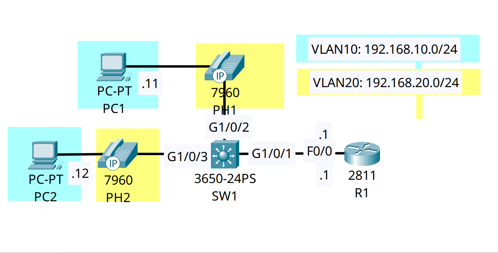

<div align="center">

# 🔄 Converged Campus Edge: Voice VLANs & IP Telephony Daisy-Chaining

[](https://cisco.com)
[](https://cisco.com)
[]()
[]()

<p align="center">
  <b>Optimizing port density and ensuring VoIP quality by utilizing the internal 3-port switch inside Cisco IP Phones to multiplex untagged data and tagged voice traffic over a single cable.</b>
</p>

</div>

---

## 📌 Executive Summary & Engineering Objective

In a modern enterprise campus, deploying a dedicated physical switchport for every PC and a separate physical port for every IP Phone is financially and physically impractical. 

This lab demonstrates the industry-standard **Converged Access** architecture. Cisco IP Phones contain a miniature internal 3-port switch. By configuring an access port with an auxiliary **Voice VLAN**, the upstream switch uses Cisco Discovery Protocol (CDP) to instruct the IP Phone to tag its VoIP packets with an 802.1Q/802.1p header (VLAN 20). Meanwhile, the daisy-chained PC sends standard untagged frames, which the switch places into the Access Data VLAN (VLAN 10). 

This allows a single physical switchport to logically separate, isolate, and independently route Data and Voice traffic.

---

## 🗺️ Network Topology & Architecture

<div align="center">
  
</div>

---

## 📊 Port Allocation & Converged VLAN Schema

| Interface | Connected Device | Port Mode | Data (Untagged) VLAN | Voice (Tagged) VLAN | Upstream Path |
| :--- | :--- | :--- | :--- | :--- | :--- |
| **`Gig1/0/2`** | `PH1` + `PC1` | Static Access | `VLAN 10` (Engineering) | `VLAN 20` (Telephony) | Layer 2 Edge |
| **`Gig1/0/3`** | `PH2` + `PC2` | Static Access | `VLAN 10` (Engineering) | `VLAN 20` (Telephony) | Layer 2 Edge |
| **`Gig1/0/1`** | `R1` (Gateway)| 802.1Q Trunk | Native / Default | Tagged (ROAS) | Layer 3 Uplink |

---

## 🛠️ Cisco IOS Configuration Highlights

### 🔹 SW1: Configuring the Converged Access Ports
```ios
SW1(config)# interface range GigabitEthernet1/0/2-3
SW1(config-if-range)# description ## Converged Access: IP Phone + Daisy-Chained PC ##

! 1. Assign the untagged Data VLAN for the PC
SW1(config-if-range)# switchport mode access
SW1(config-if-range)# switchport access vlan 10

! 2. Assign the tagged auxiliary Voice VLAN for the IP Phone
SW1(config-if-range)# switchport voice vlan 20
```

### 🔹 SW1: Configuring the ROAS Trunk Uplink
```ios
SW1(config)# interface GigabitEthernet1/0/1
SW1(config-if)# description ## 802.1Q Trunk Uplink to Gateway Router ##
SW1(config-if)# switchport mode trunk
SW1(config-if)# switchport trunk allowed vlan 10,20
```

---

## 🔍 Verification & Operational Proof (802.1Q Multiplexing)

The following output validates how the switch physically processes frames arriving on a single cable from the converged endpoints.

### Edge Port Verification (`Gig1/0/2`)
```text
SW1# show interfaces gigabitEthernet1/0/2 switchport
Name: Gig1/0/2
Switchport: Enabled
Administrative Mode: static access
Operational Mode: static access
Administrative Trunking Encapsulation: dot1q
Operational Trunking Encapsulation: native
Negotiation of Trunking: Off

Access Mode VLAN: 10 (VLAN0010)
Trunking Native Mode VLAN: 1 (default)
Voice VLAN: 20
```
*Validation:* 
* **Operational Mode is `static access`:** Even though it is carrying tagged voice frames (acting like a mini-trunk), the port operates safely as an access port, preventing unauthorized switches from initiating DTP trunk negotiation.
* **Dual VLAN Assignment:** The port correctly segregates untagged frames into `VLAN 10` and 802.1p/Q tagged VoIP frames into `VLAN 20`.

---

## 🧰 NOC Diagnostic & Troubleshooting Cheat Sheet

| Diagnostic Command | Execution Mode | Incident Response Application |
| :--- | :--- | :--- |
| `show interfaces [id] switchport` | Privileged EXEC (`#`) | Verifies the operational status of the auxiliary Voice VLAN on an edge port. |
| `show mac address-table interface [id]` | Privileged EXEC (`#`) | Confirms that two separate MAC addresses (the IP Phone and the PC) are learned on the same physical port across two different VLANs. |
| `show cdp neighbors detail` | Privileged EXEC (`#`) | Validates that the switch is detecting the Cisco IP phone. *If CDP is disabled globally or on the interface, the switch cannot negotiate the Voice VLAN ID with the phone, causing VoIP failure.* |
| `show vlan brief` | Privileged EXEC (`#`) | Ensures the Voice VLAN actually exists in the local VLAN database. |

---

## ⚡ Key NOC Takeaway
**Never disable CDP on an IP Phone port.** Unlike generic PCs, Cisco IP Phones rely on Cisco Discovery Protocol (CDP) to dynamically learn the Voice VLAN ID from the switch during their boot sequence. Without CDP, the phone falls back to sending untagged VoIP packets into the PC Data VLAN, destroying Quality of Service (QoS) boundaries.

---

## 📦 Included Artifacts

* `switchport-voice-vlan-telephony.pkt` — Packet Tracer converged access simulation.
* `topology.png` — Network topology diagram.
* `sw1-config.ios` — Access switch configuration demonstrating auxiliary voice VLAN assignment.
