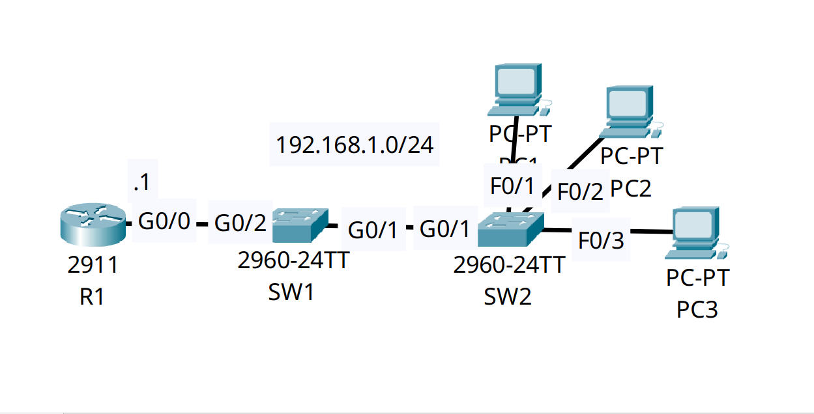

<div align="center">

# 🔄 Layer 2 Security: DHCP Snooping & Dynamic ARP Inspection (DAI)

[](https://cisco.com)
[-1BA0D7?style=for-the-badge&logo=cisco&logoColor=white)](https://cisco.com)
[]()
[]()

<p align="center">
  <b>Neutralizing Rogue DHCP servers and mitigating ARP Poisoning attacks by enforcing strict trust boundaries and payload validation at the campus edge.</b>
</p>

</div>

---

## 📌 Executive Summary & Engineering Objective

In an unsecured Layer 2 network, any host can act maliciously by standing up a rogue DHCP server to distribute fake default gateways, or by broadcasting gratuitous ARP replies to intercept traffic (ARP Poisoning / Man-in-the-Middle). 

This lab demonstrates how to secure the campus access layer using two interdependent Cisco features:
1. **DHCP Snooping:** Establishes a "Trust Boundary." The switch drops DHCP `OFFER` and `ACK` packets originating from untrusted host-facing ports. It also builds a dynamically verified database (Binding Table) mapping legitimate MAC addresses to their assigned IP addresses.
2. **Dynamic ARP Inspection (DAI):** Intercepts all ARP packets on untrusted ports and cross-references them against the DHCP Snooping Binding Table. If a malicious host attempts to spoof an IP address that it was not officially leased, the switch drops the ARP packet and logs the violation.

---

## 🗺️ Network Topology & Architecture

<div align="center">
  
</div>

---

## 📊 Trust Boundary & Security Schema

| Device | Interface | Role / Zone | DHCP Snooping State | DAI State | Allowed Action |
| :--- | :--- | :--- | :--- | :--- | :--- |
| **SW1/SW2** | `FastEthernet0/1-24`| Host / Access Edge | **Untrusted** | **Untrusted** | DHCP Requests only. ARP packets validated. |
| **SW1** | `Gig0/1` | Downlink to SW2 | **Untrusted** | **Untrusted** | Monitored transit link. |
| **SW1** | `Gig0/2` | Uplink to Gateway | **Trusted** | **Trusted** | DHCP Offers/Acks permitted. ARP bypasses validation. |
| **R1** | `Gig0/0` | Authorized Gateway| N/A | N/A | Legitimate DHCP Server (`192.168.1.1`). |

---

## 🛠️ Cisco IOS Configuration Highlights

### 🔹 R1: Authorized Edge DHCP Server
```ios
R1(config)# ip dhcp excluded-address 192.168.1.1 192.168.1.9
R1(config)# ip dhcp pool POOL
R1(config-dhcp)# network 192.168.1.0 255.255.255.0
R1(config-dhcp)# default-router 192.168.1.1
```

### 🔹 SW1: DHCP Snooping & Trust Boundaries
```ios
! 1. Enable globally and per-VLAN
SW1(config)# ip dhcp snooping
SW1(config)# ip dhcp snooping vlan 1

! 2. Prevent dropping packets due to Option 82 zero-giaddr mismatch (Common topology fix)
SW1(config)# no ip dhcp snooping information option

! 3. Establish the Trust Boundary on the uplink to the legitimate DHCP server
SW1(config)# interface GigabitEthernet0/2
SW1(config-if)# ip dhcp snooping trust
```

### 🔹 SW1: Dynamic ARP Inspection (DAI) & Payload Validation
```ios
! 1. Enable DAI for the VLAN
SW1(config)# ip arp inspection vlan 1

! 2. Enable deep payload inspection to catch sophisticated spoofing
SW1(config)# ip arp inspection validate src-mac dst-mac ip

! 3. Trust the uplink so the gateway's ARP replies aren't dropped
SW1(config)# interface GigabitEthernet0/2
SW1(config-if)# ip arp inspection trust
```

---

## 🔍 Verification & Operational Proof

### 1. The DHCP Snooping Binding Database (SW2)
```text
SW2# show ip dhcp snooping binding
MacAddress          IpAddress        Lease(sec)  Type           VLAN  Interface
------------------  ---------------  ----------  -------------  ----  -----------------
00:01:64:32:B9:22   192.168.1.10     86400       dhcp-snooping  1     FastEthernet0/1
00:60:70:DB:6A:23   192.168.1.11     86400       dhcp-snooping  1     FastEthernet0/2
00:0A:41:A6:B6:0E   192.168.1.12     86400       dhcp-snooping  1     FastEthernet0/3
Total number of bindings: 3
```
*Validation:* The switch has successfully intercepted DHCP transactions on untrusted edge ports and built a verified, dynamic database of MAC-to-IP mappings. This database is now the source of truth for DAI.

### 2. DAI Deep Inspection Status (SW1)
```text
SW1# show ip arp inspection

Source Mac Validation      : Enabled
Destination Mac Validation : Enabled
IP Address Validation      : Enabled

 Vlan     Configuration    Operation   ACL Match          Static ACL
 ----     -------------    ---------   ---------          ----------
    1     Enabled          Active
```
*Validation:* DAI is fully operational on VLAN 1. Payload validation is enabled, meaning the switch verifies the MAC and IP addresses inside the ARP packet payload, not just the Ethernet header.

---

## 🧰 NOC Diagnostic & Troubleshooting Cheat Sheet

| Diagnostic Command | Execution Mode | Incident Response Application |
| :--- | :--- | :--- |
| `show ip dhcp snooping binding` | Privileged EXEC (`#`) | Displays the dynamic MAC-to-IP mappings. If a host has no IP or cannot pass traffic via DAI, verify its binding here first. |
| `show ip dhcp snooping` | Privileged EXEC (`#`) | Verifies which interfaces are trusted. Used to hunt down misconfigured rogue DHCP server ports. |
| `show ip arp inspection interfaces` | Privileged EXEC (`#`) | Confirms the trust state of ports for DAI. Missing trust on an uplink will sever all gateway communication. |
| `clear ip dhcp snooping binding` | Privileged EXEC (`#`) | Clears the database. Useful if a host changes IP or MAC address and DAI is aggressively blocking its new ARP broadcasts. |

---

## ⚡ Key Takeaway
**Security by Default:** All ports in a DHCP Snooping and DAI architecture default to **untrusted**. Engineers must explicitly configure `trust` on upstream links pointing toward legitimate infrastructure. Furthermore, disabling Option 82 insertion (`no ip dhcp snooping information option`) is critical in multi-switch environments without a centralized relay agent to prevent dropped `DHCP DISCOVER` broadcasts.

---

## 📦 Included Artifacts

* `dhcp-snooping-and-dynamic-arp-dai.pkt` — Packet Tracer Layer 2 security simulation.
* `topology.png` — Network topology diagram.
* `r1-config.ios` — Edge Router configuration acting as the authorized DHCP server.
* `sw1-config.ios` — Access Switch configuration demonstrating Trust Boundaries, Snooping, and DAI validation.
