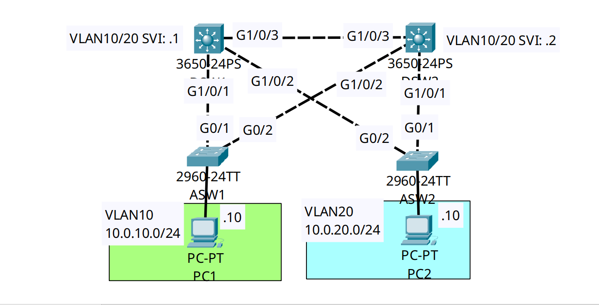

<div align="center">

# 🔄 Layer 2/3 Convergence: STP & HSRP Synchronization

[](https://cisco.com)
[](https://cisco.com)
[]()
[]()

<p align="center">
  <b>Eliminating suboptimal Layer 2 switching paths ("trunk hair-pinning") by perfectly aligning the Spanning Tree Root Bridge with the HSRP Active Gateway across multiple distribution VLANs.</b>
</p>

</div>

---

## 📌 Executive Summary & Engineering Objective

In a dual-tier campus network utilizing Multilayer Switches (DSW1 & DSW2), First Hop Redundancy Protocols (HSRP/VRRP) provide Layer 3 default gateway redundancy. However, Spanning Tree Protocol (STP) dictates the physical Layer 2 forwarding path.

**The Architectural Threat:** If the STP Root Bridge is on `DSW1`, but the HSRP Active Gateway is on `DSW2`, host traffic is forced to cross the Layer 2 access switch, traverse the trunk to `DSW1`, realize `DSW1` is not the gateway, and cross the inter-switch trunk over to `DSW2` before it can be routed. This is known as **"Trunk Hair-Pinning,"** causing latency and halving backplane bandwidth.

**The Solution:** This lab demonstrates **STP & HSRP Synchronization**. 
* For VLAN 10, `DSW1` is aggressively tuned to be both the STP Primary Root and the HSRP Active Gateway. 
* For VLAN 20, `DSW2` is tuned to be both the STP Primary Root and the HSRP Active Gateway. 
This results in an optimal **Active-Active** distribution layer where traffic never hair-pins across the core trunk.

---

## 🗺️ Network Topology & Architecture

<div align="center">
  
</div>

---

## 📊 Alignment Schema & Tuning Matrix

| Switch | Target VLAN | HSRP Priority | HSRP Role | STP Priority | STP Role | Result |
| :--- | :--- | :--- | :--- | :--- | :--- | :--- |
| **DSW1** | **VLAN 10** | `105` (Preempt) | **Active** | `24576` | **Primary Root** | **Aligned (Optimal Path)** |
| **DSW1** | VLAN 20 | `95` (Preempt) | Standby | `28672` | Secondary Root | Standby / Backup |
| **DSW2** | **VLAN 20** | `105` (Preempt) | **Active** | `24576` | **Primary Root** | **Aligned (Optimal Path)** |
| **DSW2** | VLAN 10 | `95` (Preempt) | Standby | `28672` | Secondary Root | Standby / Backup |

---

## 🛠️ Cisco IOS Configuration Highlights

### 🔹 DSW1: Enforcing Primary Role for VLAN 10 (Secondary for 20)
```ios
! 1. Align Layer 2 Spanning Tree (PVST+)
DSW1(config)# spanning-tree vlan 10 priority 24576
DSW1(config)# spanning-tree vlan 20 priority 28672

! 2. Align Layer 3 HSRPv2 Gateways
DSW1(config)# interface Vlan10
DSW1(config-if)# standby version 2
DSW1(config-if)# standby 10 ip 10.0.10.254
DSW1(config-if)# standby 10 priority 105
DSW1(config-if)# standby 10 preempt

DSW1(config)# interface Vlan20
DSW1(config-if)# standby version 2
DSW1(config-if)# standby 20 ip 10.0.20.254
DSW1(config-if)# standby 20 priority 95
DSW1(config-if)# standby 20 preempt
```

### 🔹 DSW2: Enforcing Primary Role for VLAN 20 (Secondary for 10)
```ios
! 1. Align Layer 2 Spanning Tree (PVST+)
DSW2(config)# spanning-tree vlan 20 priority 24576
DSW2(config)# spanning-tree vlan 10 priority 28672

! 2. Align Layer 3 HSRPv2 Gateways
DSW2(config)# interface Vlan20
DSW2(config-if)# standby version 2
DSW2(config-if)# standby 20 ip 10.0.20.254
DSW2(config-if)# standby 20 priority 105
DSW2(config-if)# standby 20 preempt
```

---

## 🔍 Verification & Operational Proof

### 1. HSRP Active/Standby Verification (DSW1)
```text
DSW1# show standby brief
                     P indicates configured to preempt.
                     |
Interface   Grp  Pri P State    Active          Standby         Virtual IP
Vl10        10   105 P Active   local           10.0.10.2       10.0.10.254    
Vl20        20   95  P Standby  10.0.20.2       local           10.0.20.254    
```
*Validation:* `DSW1` successfully holds the **Active** gateway role for `Vl10` (Priority 105) and the **Standby** role for `Vl20` (Priority 95).

### 2. Spanning Tree Root Verification (DSW1 - VLAN 10)
```text
DSW1# show spanning-tree vlan 10
VLAN0010
  Spanning tree enabled protocol ieee
  Root ID    Priority    24586
             Address     000C.856A.50BD
             This bridge is the root
```
*Validation:* `DSW1` is the definitive Spanning Tree Root Bridge for VLAN 10. **The physical forwarding path and logical routing gateway are perfectly aligned.**

---

## 🧰 NOC Diagnostic & Troubleshooting Cheat Sheet

| Diagnostic Command | Execution Mode | Incident Response Application |
| :--- | :--- | :--- |
| `show standby brief` | Privileged EXEC (`#`) | Instantly displays Active vs Standby roles, configured priorities, and virtual IPs for all HSRP instances. |
| `show spanning-tree root` | Privileged EXEC (`#`) | Displays the MAC address and priority of the root bridge for every active VLAN. Compare this against `show standby brief` to detect hair-pinning. |
| `traceroute [destination]` | Exec (`>`) | Run from a host PC. The first hop should be the Virtual IP. A layer-2 capture (Wireshark) should prove the frame went directly to the correct Distribution Switch. |

---

## ⚡ Key NOC Takeaway
**Configuration drift kills performance.** If an engineer adds a new VLAN to a distribution block and configures HSRP without adjusting Spanning Tree priorities to match, 50% of the network traffic for that VLAN will needlessly bounce across inter-switch trunks. Always provision FHRPs and STP priorities together as a matched pair.

---

## 📦 Included Artifacts

* `stp-hsrp-active-root-alignment.pkt` — Packet Tracer Layer 2/3 convergence simulation.
* `topology.png` — Network topology diagram.
* `dsw1-config.ios` — Multilayer Switch 1 config (Active/Root for VLAN 10).
* `dsw2-config.ios` — Multilayer Switch 2 config (Active/Root for VLAN 20).
