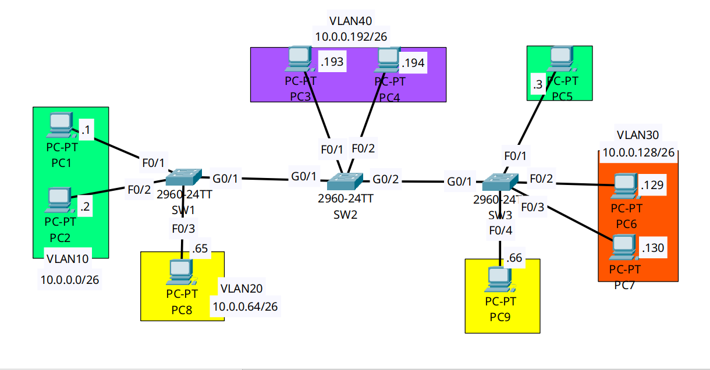

<div align="center">

# 🔄 Layer 2 Enterprise Switching: VTP Multi-Mode Architecture & DTP Suppression

[](https://cisco.com)
[-1BA0D7?style=for-the-badge&logo=cisco&logoColor=white)](https://cisco.com)
[]()
[-orange?style=for-the-badge)]()

<p align="center">
  <b>Demonstrating VLAN Trunking Protocol (VTP) advertisement propagation across intermediate Transparent switches while mitigating Dynamic Trunking Protocol (DTP) spoofing vulnerabilities on inter-switch uplinks.</b>
</p>

</div>

---

## 📌 Executive Summary & Engineering Objective

In multi-switch enterprise campus networks, manually provisioning VLAN databases on every individual switch introduces configuration drift and operational overhead. **VLAN Trunking Protocol (VTP)** automates the distribution and synchronization of the VLAN database across a Layer 2 domain.

However, unmanaged VTP deployments present critical architectural risks:
1. **The VTP Catastrophe:** An unmanaged switch introduced with a higher Configuration Revision number can overwrite and erase the entire corporate VLAN database.
2. **DTP Vulnerabilities:** Leaving Dynamic Trunking Protocol (DTP) enabled allows rogue access ports to negotiate into 802.1Q trunks, granting attackers access to all tagged VLANs (VLAN Hopping).

This lab demonstrates an enterprise VTP deployment and hardening baseline:
* **The 3-Switch Transit Architecture:** `SW1` (Server) propagates updates through `SW2` (Transparent) to `SW3` (Client). This proves that Transparent mode switches do not modify their local database but reliably forward VTP advertisements across their trunks.
* **DTP Eradication:** All inter-switch links are statically forced into trunk mode with DTP disabled (`switchport nonegotiate`), enforcing an explicit security posture.

---

## 🗺️ Network Topology & Architecture

<div align="center">
  
</div>

---

## 📊 VTP Operating Modes & Database Schema

| Switch | VTP Operating Mode | Domain Name | Config Revision | MD5 Digest | Local VLAN Behavior |
| :--- | :--- | :--- | :---: | :--- | :--- |
| **`SW1`** | **Server** | `CCNA` | **`5`** | `...CA A1 CD A2 C9 E0` | Creates, modifies, and deletes VLANs; propagates updates. |
| **`SW2`** | **Transparent** | `CCNA` | **`0`** | `...25 38 3F C3 17 DB 38` | Local changes only (`VLAN 40`); forwards VTP packets without syncing. |
| **`SW3`** | **Client** | `CCNA` | **`5`** | `...CA A1 CD A2 C9 E0` | Read-only; synchronizes database and revision directly from `SW1`. |

---

## 🛠️ Cisco IOS Configuration Highlights

### 🔹 SW1: VTP Server & DTP Suppression
```ios
! 1. Configure VTP domain and operational mode
SW1(config)# vtp domain CCNA
SW1(config)# vtp mode server

! 2. Create campus departmental VLANs
SW1(config)# vlan 10,20,30,40,50

! 3. Hard-code 802.1Q trunk and suppress DTP frame generation
SW1(config)# interface GigabitEthernet0/1
SW1(config-if)# description ## Trunk Uplink to SW2 (DTP Suppressed) ##
SW1(config-if)# switchport mode trunk
SW1(config-if)# switchport nonegotiate
```

### 🔹 SW2: VTP Transparent Mode Transit Switch
```ios
! Transparent mode isolates local database while relaying VTP advertisements
SW2(config)# vtp domain CCNA
SW2(config)# vtp mode transparent

! Local VLANs can be created without incrementing global domain revisions
SW2(config)# vlan 40
SW2(config)# interface range FastEthernet0/1-2
SW2(config-if-range)# switchport mode access
SW2(config-if-range)# switchport access vlan 40
```

### 🔹 SW3: VTP Client Mode Access Switch
```ios
! Client mode prevents local edits and locks synchronization to Server
SW3(config)# vtp domain CCNA
SW3(config)# vtp mode client
```

---

## 🔍 Verification & Operational Proof

### 1. Proof of Transparent Relay Synchronization (`SW1` ➔ `SW3`)
```text
SW1# show vtp status
VTP Operating Mode              : Server
Configuration Revision          : 5
Number of existing VLANs        : 10
MD5 digest                      : 0xC6 0x83 0xCA 0xA1 0xCD 0xA2 0xC9 0xE0 
```

```text
SW2# show vtp status
VTP Operating Mode              : Transparent
Configuration Revision          : 0
Number of existing VLANs        : 10
MD5 digest                      : 0x20 0x25 0x38 0x3F 0xC3 0x17 0xDB 0x38 
```

```text
SW3# show vtp status
VTP Operating Mode              : Client
Configuration Revision          : 5
Number of existing VLANs        : 10
MD5 digest                      : 0xC6 0x83 0xCA 0xA1 0xCD 0xA2 0xC9 0xE0 
```
*Validation:* 
* `SW1` and `SW3` share the exact same **Configuration Revision (`5`)** and identical **MD5 digests (`...C9 E0`)**.
* `SW2` maintained a revision of **`0`**, proving that intermediate Transparent switches do not adopt server databases, yet forward VTP frames so downstream clients synchronize without interruption.

### 2. Validating DTP Suppression (`SW1`)
```text
SW1# show interfaces GigabitEthernet0/1 switchport
Name: Gig0/1
Switchport: Enabled
Administrative Mode: trunk
Operational Mode: trunk
Administrative Trunking Encapsulation: dot1q
Operational Trunking Encapsulation: dot1q
Negotiation of Trunking: Off
```
*Validation:* `Negotiation of Trunking: Off` confirms `switchport nonegotiate` is active. The switch does not transmit DTP dynamic negotiation frames, mitigating VLAN hopping attacks.

---

## 🧰 NOC Diagnostic & Troubleshooting Cheat Sheet

| Diagnostic Command | Execution Mode | Incident Response Application |
| :--- | :--- | :--- |
| `show vtp status` | Privileged EXEC (`#`) | Displays VTP domain, operating mode, revision number, and MD5 digest. |
| `show interfaces [id] switchport` | Privileged EXEC (`#`) | Verifies `Negotiation of Trunking: Off`. If set to `On`, the link is susceptible to DTP spoofing. |
| `show vtp password` | Privileged EXEC (`#`) | Verifies if an MD5 domain password was applied. (Mismatched passwords silently drop VTP updates). |
| `show interfaces trunk` | Privileged EXEC (`#`) | Confirms active 802.1Q encapsulation and verifies allowed/active VLAN lists across the interlink. |

---

## ⚡ Key NOC Takeaway: The VTP Database Wipeout Defense
When adding a pre-owned or lab switch to a production network, **never connect it while in VTP Client or Server mode without checking its revision number.** If its Configuration Revision is higher than the production Server, it will overwrite the production VLAN database across the entire domain, instantly causing widespread network failure.

**The Golden Rule:** Always change the switch's domain name to a temporary dummy string or set its mode to **`transparent`** (which resets the revision number to `0`) before connecting it to a live network.

---

## 📦 Included Artifacts

* `vtp-modes-and-dtp-hardening.pkt` — Packet Tracer multi-switch VTP simulation.
* `topology.png` — Network topology diagram.
* `sw1-config.ios` — VTP Server configuration with DTP suppression.
* `sw2-config.ios` — VTP Transparent transit configuration with local VLAN isolation.
* `sw3-config.ios` — VTP Client access configuration.
