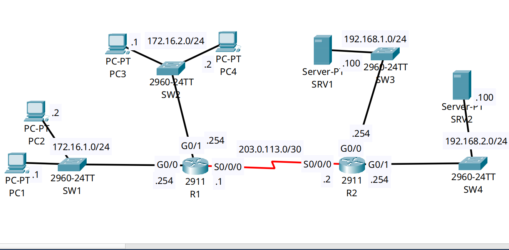

<div align="center">

# 🔄 Enterprise Edge Security: Multi-Service Extended Access Control Lists (L4 Filtering)

[-00599C?style=for-the-badge&logo=cisco&logoColor=white)](https://cisco.com)
[_|_HTTP(S)_(80/443)-1BA0D7?style=for-the-badge&logo=cisco&logoColor=white)](https://cisco.com)
[]()
[]()

<p align="center">
  <b>Enforcing Layer 4 granular security policies by suppressing unauthorized application traffic (DNS, HTTP, HTTPS) and host reachability at the network ingress boundary before consuming WAN transit bandwidth.</b>
</p>

</div>

---

## 📌 Executive Summary & Engineering Objective

In enterprise routing and campus security, filtering traffic using basic packet filtering must adhere to strict architectural placement rules:
* **Standard ACLs (1–99 / 1300–1999):** Filter based **only on Source IP**. Because they cannot evaluate destinations or protocols, they must be placed as close to the **destination** as possible to prevent unintentionally blackholing legitimate traffic to other services.
* **Extended ACLs (100–199 / 2000–2699):** Filter based on **Source IP, Destination IP, Protocol (IP, TCP, UDP, ICMP), and Layer 4 Port Numbers**. Because they have full visibility into the packet's intent, they must be placed as close to the **source** as possible.

This lab proves advanced Layer 4 firewalling at the router edge:
1. **Source-Based Traffic Dropping:** Applying Extended ACLs `101` and `102` inbound on `R1`'s local LAN interfaces (`Gig0/0` and `Gig0/1`). By dropping unauthorized traffic at ingress, packets never transit the point-to-point serial WAN circuit (`Serial0/0/0`), saving precious WAN link bandwidth.
2. **Layer 4 Application Filtering:** Blocking specific transport layer sockets: DNS (UDP port 53), Web (TCP port 80), and Secure Web (TCP port 443) targeting dedicated enterprise servers (`SRV1` and `SRV2`).
3. **Explicit Host Isolation:** Isolating specific engineering workstations (`PC1: 172.16.1.1`) from adjacent departmental subnets.

---

## 🗺️ Network Topology & Architecture

<div align="center">
  
</div>

---

## 📊 Security Policy & Enforcement Schema

| Policy Name | Target Source | Protected Destination | Protocol / Port | Applied Interface | Action |
| :--- | :--- | :--- | :---: | :--- | :---: |
| **Host Isolation** | `172.16.2.0/24` (LAN 2) | `172.16.1.1` (PC1) | All IP (`ip`) | `R1: Gig0/1 (in)` | **DENY** |
| **HTTPS Filter** | `172.16.2.0/24` (LAN 2) | `192.168.2.100` (SRV2) | TCP / `443` | `R1: Gig0/1 (in)` | **DENY** |
| **HTTP Filter** | `172.16.2.0/24` (LAN 2) | `192.168.2.100` (SRV2) | TCP / `80 (www)` | `R1: Gig0/1 (in)` | **DENY** |
| **LAN 2 General**| `172.16.2.0/24` (LAN 2) | Any Network | All IP (`ip`) | `R1: Gig0/1 (in)` | **PERMIT** |
| **DNS Filter** | `172.16.1.0/24` (LAN 1) | `192.168.1.100` (SRV1) | UDP / `53 (domain)` | `R1: Gig0/0 (in)` | **DENY** |
| **LAN 1 General**| `172.16.1.0/24` (LAN 1) | Any Network | All IP (`ip`) | `R1: Gig0/0 (in)` | **PERMIT** |

---

## 🛠️ Cisco IOS Configuration Highlights

### 🔹 R1: Extended ACL 101 (LAN 2 Policy Enforcement)
```ios
! Applied inbound on GigabitEthernet0/1 (Close to the source)
access-list 101 deny ip 172.16.2.0 0.0.0.255 host 172.16.1.1
access-list 101 deny tcp 172.16.2.0 0.0.0.255 host 192.168.2.100 eq 443
access-list 101 deny tcp 172.16.2.0 0.0.0.255 host 192.168.2.100 eq www
access-list 101 permit ip any any
!
interface GigabitEthernet0/1
 description ## LAN 2 Gateway - Ingress Filter ##
 ip address 172.16.2.254 255.255.255.0
 ip access-group 101 in
```

### 🔹 R1: Extended ACL 102 (LAN 1 DNS Suppression)
```ios
! Applied inbound on GigabitEthernet0/0 (Close to the source)
access-list 102 deny udp 172.16.1.0 0.0.0.255 host 192.168.1.100 eq domain
access-list 102 permit ip any any
!
interface GigabitEthernet0/0
 description ## LAN 1 Gateway - Ingress Filter ##
 ip address 172.16.1.254 255.255.255.0
 ip access-group 102 in
```

### 🔹 Architectural Highlight: Why R2 Has No ACLs Configured
Inspecting `R2` confirms **zero access lists** are applied to its interfaces. Because `R1` drops unauthorized packets before they enter the WAN link, `R2` is completely relieved of evaluating policy filters. This reduces CPU overhead on the destination gateway and keeps the `Serial0/0/0` circuit free of dropped traffic.

---

## 🔍 Verification & Operational Proof

### 1. Active Access-List Validation & Sequence Ordering (R1)
```text
R1# show access-lists
Extended IP access list 101
    10 deny ip 172.16.2.0 0.0.0.255 host 172.16.1.1
    20 deny tcp 172.16.2.0 0.0.0.255 host 192.168.2.100 eq 443
    30 deny tcp 172.16.2.0 0.0.0.255 host 192.168.2.100 eq www
    40 permit ip any any
Extended IP access list 102
    10 deny udp 172.16.1.0 0.0.0.255 host 192.168.1.100 eq domain
    20 permit ip any any
```
*Validation:* 
* Rules are compiled in top-down sequential order. Specific `deny` statements precede the broad `permit ip any any` statement.
* Port numbers are automatically translated to Cisco keywords where applicable (`eq 80` ➔ `eq www`, `eq 53` ➔ `eq domain`).

### 2. Interface Ingress Binding Verification
```text
R1# show ip interface GigabitEthernet0/0 | include Inbound
  Inbound  access list is 102
R1# show ip interface GigabitEthernet0/1 | include Inbound
  Inbound  access list is 101
```
*Validation:* Both access lists are actively filtering inbound traffic at the edge interface level.

---

## 🧰 NOC Diagnostic & Troubleshooting Cheat Sheet

| Diagnostic Command | Execution Mode | Incident Response Application |
| :--- | :--- | :--- |
| `show access-lists` | Privileged EXEC (`#`) | Displays all ACL statements along with match counters (`(x matches)`). If counters aren't incrementing, the ACL is applied to the wrong interface or direction. |
| `clear access-list counters` | Privileged EXEC (`#`) | Resets packet match counters to zero. Essential before initiating a test ping or service connection to confirm rule hits. |
| `show ip interface [id]` | Privileged EXEC (`#`) | Confirms whether an access-group is bound `Inbound` or `Outbound` on an interface. |

---

## ⚡ Key NOC Takeaway: The Implicit Deny & The Return Traffic Trap
1. **The Implicit Deny:** Every Cisco ACL terminates with an invisible **`deny ip any any`**. If an engineer forgets the explicit `permit ip any any` at the bottom of an ACL, all unlisted traffic (including ICMP, OSPF, and DHCP) will be silently dropped.
2. **Direction Matters (`in` vs `out`):** Applying an ACL `in` filters packets arriving into the router before routing lookup. Applying an ACL `out` filters packets after routing decisions are made, just before exiting the physical port. Inbound ACLs consume fewer CPU cycles on rejected packets.

---

## 📦 Included Artifacts

* `enterprise-extended-acls-service-filtering.pkt` — Packet Tracer multi-service security simulation.
* `topology.png` — Network topology diagram.
* `r1-config.ios` — Ingress Edge Router configuration with Extended ACLs 101 and 102.
* `r2-config.ios` — Destination Server Gateway configuration.
